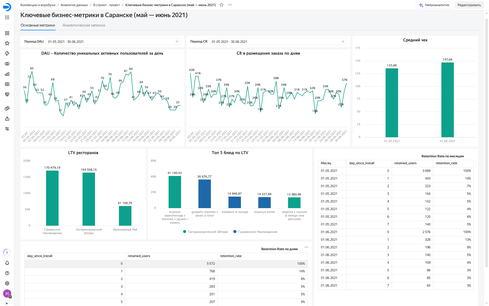

# Ключевые бизнес-метрики сервиса доставки еды

## 📊 О проекте

Проект выполнен для сервиса доставки еды. Задача – подготовить дашборд, отражающий состояние клиентской базы за период с 1 мая по 30 июня 2021 года, и составить аналитическую записку с выводами по ключевым метрикам.

**Ключевые метрики:**
- DAU (ежедневно активные пользователи)
- Conversion Rate (коэффициент конверсии в заказ)
- Средний чек (комиссия сервиса с заказа)
- LTV ресторанов и блюд
- Retention Rate (удержание пользователей)

На основе SQL-запросов в **Yandex DataLens** построены визуализации, позволяющие отслеживать динамику показателей, выявлять тренды и аномалии. Результаты оформлены в виде аналитической записки с рекомендациями для бизнеса.

## 🛠 Инструменты

- **Yandex DataLens** – создание чартов и дашборда
- **SQL** (PostgreSQL) – расчёт метрик, агрегация данных
- **Google Docs / Markdown** – оформление аналитической записки

## 📁 Структура репозитория
delivery-metrics-datalens/  
├── README.md  
├── /dashboard  
│ ├── /images  
│ │ └── dashboard_overview.png  
│ └── link.txt # ссылка на опубликованный дашборд  

## 🗃 SQL‑запросы

Ниже приведены ключевые расчёты.

### DAU (активные пользователи в день)
```
SELECT log_date,
       COUNT(DISTINCT user_id) AS DAU
FROM rest_analytics.analytics_events AS events
JOIN rest_analytics.cities cities ON events.city_id = cities.city_id
WHERE log_date BETWEEN '2021-05-01' AND '2021-06-30'
  AND city_name = 'Саранск'
  AND event = 'order'
GROUP BY log_date
ORDER BY log_date;
```

### Conversion Rate (конверсия в заказ)
```
SELECT log_date,
       ROUND((COUNT(DISTINCT user_id) FILTER (WHERE event = 'order'))::numeric /
             COUNT(DISTINCT user_id), 2) AS CR
FROM rest_analytics.analytics_events AS events
JOIN rest_analytics.cities cities ON events.city_id = cities.city_id
WHERE log_date BETWEEN '2021-05-01' AND '2021-06-30'
  AND city_name = 'Саранск'
GROUP BY log_date
ORDER BY log_date;
```

### Средний чек (комиссия сервиса)
```
WITH orders AS (
  SELECT *,
         revenue * commission AS commission_revenue
  FROM rest_analytics.analytics_events AS events
  JOIN rest_analytics.cities cities ON events.city_id = cities.city_id
  WHERE revenue IS NOT NULL
    AND log_date BETWEEN '2021-05-01' AND '2021-06-30'
    AND city_name = 'Саранск'
)
SELECT CAST(DATE_TRUNC('month', log_date) AS date) AS month,
       COUNT(DISTINCT order_id) AS orders_count,
       ROUND(SUM(commission_revenue)::numeric, 2) AS total_commission,
       ROUND((SUM(commission_revenue) / COUNT(DISTINCT order_id))::numeric, 2) AS avg_check
FROM orders
GROUP BY month
ORDER BY month;
```

### LTV ресторанов (топ-3)
```
WITH orders AS (
  SELECT events.rest_id,
         events.city_id,
         revenue * commission AS commission_revenue
  FROM rest_analytics.analytics_events AS events
  JOIN rest_analytics.cities cities ON events.city_id = cities.city_id
  WHERE revenue IS NOT NULL
    AND log_date BETWEEN '2021-05-01' AND '2021-06-30'
    AND city_name = 'Саранск'
)
SELECT orders.rest_id,
       chain AS restaurant_name,
       type AS cuisine_type,
       ROUND(SUM(commission_revenue)::numeric, 2) AS LTV
FROM orders
JOIN rest_analytics.partners ON orders.rest_id = partners.rest_id AND orders.city_id = partners.city_id
GROUP BY 1, 2, 3
ORDER BY LTV DESC
LIMIT 3;
```

## 📈 Дашборд в Yandex DataLens
На основе подготовленных SQL-запросов в DataLens созданы следующие чарты:

- **DAU - количество уникальных активных пользователей в день** – линейный график ежедневной активности пользователей.  
- **CR в размещение заказа по дням** – линейный график конверсии.  
- **Средний чек** – столбчатая диаграмма по месяцам.  
- **LTV ресторанов** - столбчатая диаграмма топ-3 ресторанов по наибольшей суммарной комиссии, полученной от заказов.  
- **Топ-5 блюд по LTV** – столбчатая диаграмма топ-5 блюд по LTV.  
- **Ratention Rate по месяцам** - таблица, показывающая,какой процент пользователей возвращается в приложение в течение первой недели после регистрации и в какие дни в каждом анализируемом месяце.
- **Ratention Rate по дням** - таблица, показывающая процент возвращаемости пользователей в приложение в течение первой недели после регистрации за весь анализируемый период.

Все чарты собраны на едином дашборде «Ключевые бизнес-метрики в Саранске (май – июнь 2021)».

## Скриншоты
  
*Вкладка «Основные метрики» с фильтрами и ключевыми метриками*

### Ссылка на дашборд

👉 **[Открыть интерактивный дашборд в Yandex DataLens](https://datalens.yandex/6ktn7s9lx53ir)**  
*Для просмотра регистрация не требуется.*

## 📝 Аналитическая записка (основные выводы)
Полный текст аналитической записки доступен на вкладке "Аналитическая записка" дашборда. Ниже приведены ключевые тезисы.

### DAU
- Пик активности – 4 мая (85 пользователей), затем спад до минимума 16 мая.  
- С 16 мая по 11 июня наблюдался устойчивый рост, после – новое падение.  
- Чёткая зависимость от дня недели: рост с понедельника к пятнице‑субботе, спад в выходные.  

### Conversion Rate
- Колеблется в диапазоне 18–43%.
- В целом повторяет динамику DAU, но с 18 июня наблюдается расхождение: при падении DAU конверсия растёт. Возможные причины: смена аудитории или маркетинговой стратегии.

### Средний чек
- Увеличивается от мая к июню. Может быть связано с ростом цен или увеличением числа блюд в заказе.

### Retention Rate
- На следующий день после установки активность сохраняют 14% пользователей.  
- К 7‑му дню остаётся 4–5% (май) и 3% (июнь). Падение удержания в июне требует внимания.

### Топ‑3 ресторана по LTV
- Гурманское наслаждение – 170 479 руб.  
- Гастрономический шторм – 164 508 руб.  
- Шоколадный рай – 61 200 руб.  

Успех первых двух связан с популярностью их блюд: 3 из 5 самых доходных блюд продаются в «Гурманском наслаждении», 2 – в «Гастрономическом шторме». Все топ‑блюда содержат мясо, 4 – рыбу, ни одно не острое.

### Рекомендации
1. Несмотря на падение DAU, лояльная аудитория растёт (конверсия и средний чек). Стоит изучить каналы привлечения этих пользователей и усилить работу с ними.
2. Основной отток происходит на следующий день после установки. Проверить интерфейс, процесс авторизации, рассмотреть возможность отправки push‑уведомлений новым пользователям.
